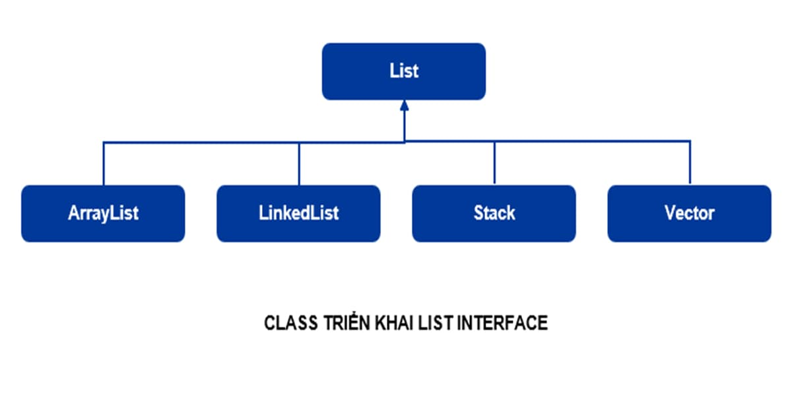

# List trong Java

List trong java là một interface trong java. Nó chứa các phương thức để chèn và xóa các phần tử dựa trên chỉ số index.

# *Sử dụng List trong Java*

Cấu trúc List là dạng tập hợp các phần tử được sắp theo thứ tự (còn được gọi là dãy tuần tự) và trong đó cho phép lặp (hai phần tử giống nhau). Vì List là một interface, nên chúng ta không thể tạo các đối tượng từ nó. Để sử dụng các tính năng của List interface, chúng ta có thể sử dụng các class sau:

- ArrayList
- LinkedList
- Vector
- Stack


<p align="center">
  
</p>

# *Khai báo List trong java*

Trong Java, chúng ta phải import package là java.util.List để sử dụng được List.

```
// ArrayList triển khai List
List<String> list1 = new ArrayList<>();

// LinkedList triển khai List
List<String> list2 = new LinkedList<>();
```

Ở đây, chúng ta đã tạo các đối tượng `list1` và `list2` của class `ArrayList` và `LinkedList`. Các đối tượng này có thể sử dụng các tính năng của List interface.

Ngoài những hàm mà nó được kế thừa từ Collection, List còn bổ sung thêm những hàm như:

| Method |Mô tả |
|:---- | :----|
|Object get(int index)|Cho lại phần tử được xác định bởi index.|
|Object set(int index, Object elem)|Thay thế phần tử được xác định bởi index bằng elem|
|void add(int index, Object elem)|Chèn elem vào sau phần tử được xác định bởi index.|
|Object remove(int index)|Bỏ đi phần tử được xác định bởi index|
|boolean addAll(int index, Collection c)|Chèn các phần tử của tập hợp c vào vị trí được xác định bởi index|
|int indexOf(Object elem)|Cho biết vị trí lần xuất hiện đầu tiên của phần tử trong danh sách|
|int lastIndexOf(Object elem)|Cho biết vị trí lần xuất hiện cuối cùng của elem trong danh sách.|
|List subList(int fromIndex, int toIndex)|Lấy ra một danh sách con từ vị trí fromIndex đến toIndex|
|ListIterator listIterator()|Cho lại các phần tử liên tiếp bắt đầu từ phần tử đầu tiên.|
|ListIterator listIterator(int index)|Cho lại các phần tử liên tiếp bắt đầu từ phần tử được xác định bởi. Trong đó ListIterator là interface mở rộng giao diện Iterator đã có trong java.lang.|

# Ví dụ về List trong java

*Hãy xem ví dụ đơn giản về List trong java sau*

 ```
import java.util.ArrayList;
import java.util.List;

public class ListExample {
    public static void main(String args[]) {
        List<String> list = new ArrayList<String>();
        list.add("Java");
        list.add("C++");
        list.add("PHP");
        list.add(1, "Python");
        System.out.println("Phan tu co index = 2 la: " + list.get(2));
        // show list
        for (String s : list) {
            System.out.println(s);
        }
    }
}
 ```


```
Phan tu co index = 2 la: C++
Java
Python
C++
PHP
```

*Sử dụng Arrays.asList()*

```
import java.util.Arrays;
import java.util.List;

public class ListExample1 {
    public static void main(String args[]) {
        // create new array
        String[] arr = { "Java", "C++", "PHP", "Python" };
        // convert array to List
        List<String> list = Arrays.asList(arr);
        // show list
        for (String s : list) {
            System.out.println(s);
        }
    }
}
```

```
Java
C++
PHP
Python
```

*List Iterator trong java*

`ListIterator` là một interface được sử dụng để duyệt các phần tử của List trong java. Các phương thức của interface ListIterator trong java

|Method|Mô tả|
|:-----|:----|
|boolean hasNext()|Phương thức này trả về true nếu list interator có tồn tại phần tử kế tiếp phần tử hiện tại.|
|Object next()|Phương thức này trả về phần tử kế tiếp trong danh sách và vị trí con trỏ tăng lên 1.|
|boolean hasPrevious()|Phương pháp này trả về true nếu list interator có tồn tại phần tử kế sau phần tử hiện tại.|
|Object previous()|Phương thức này trả về phần tử kế sau trong danh sách và vị trí con trỏ giảm đi 1|

*Hãy xem ví dụ đơn giả về việc duyệt các phần tử của List trong java bằng cách sử dụng ListIterator*

```
import java.util.ArrayList;
import java.util.List;
import java.util.ListIterator;

public class Thaycacac {
    public static void main(String args[]) {
        List<String> list = new ArrayList<String>();
        list.add("Java");
        list.add("C++");
        list.add("PHP");
        list.add(1, "Python");
        System.out.println("Phan tu co index = 2 la: " + list.get(2));

        ListIterator<String> itr = list.listIterator();
        System.out.println("Duyet cac phan tu tu dau den cuoi:");
        while (itr.hasNext()) {
            System.out.println("\t" + itr.next());
        }
        System.out.println("Duyet cac phan tu tu cuoi ve dau:");
        while (itr.hasPrevious()) {
            System.out.println("\t" + itr.previous());
        }
    }
}
```

```
Phan tu co index = 2 la: C++
Duyet cac phan tu tu dau den cuoi:
Java
Python
C++
PHP
Duyet cac phan tu tu cuoi ve dau:
PHP
C++
Python
Java
```