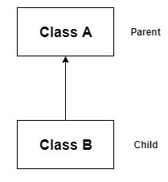
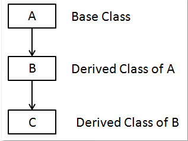
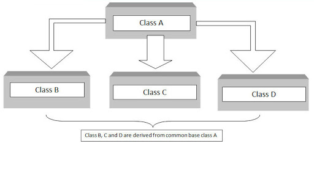

## Inheritance - Tính kế thừa

Kế thừa là sự liên quan giữa hai class với nhau, trong đó có class cha (superclass) và class con (subclass). Khi kế thừa class con được hưởng tất cả các phương thức và thuộc tính của class cha. Tuy nhiên, nó chỉ được truy cập các thành viên public và protected của class cha. Nó không được phép truy cập đến thành viên private của class cha.

Tính kế thừa là một khái niệm được hiểu những thuộc tính của một lớp có thể được kế thừa bởi một lớp khác. Nó giúp chúng ta có thể sử dụng lại code và thiết lập một mối quan hệ giữa các class khác nhau.

<p align="center">
  
</p>

Như chúng ta thấy ở hình trên, một đứa trẻ kế thừa các thuộc tính của cha cậu ấy. Tương tự, trong Java, chúng ta sẽ có 2 class như bên dưới:

* Lớp cha còn được hiểu là Lớp siêu cấp, Lớp cơ sở (Parent class hoặc Super class hay Base class)
* Lớp con còn được hiểu Lớp phụ, Lớp dẫn xuất (Child class hoặc Sub class hoặc Derived class)


Một lớp kế thừa những thuộc tính được biết đến là một Sub class trong khi một lớp có các thuộc tính được kế thừa được gọi là Parent class.

Kế thừa được phân chia làm 4 loại:

<p align="center">
  
</p>

# 1. Ví dụ về kế thừa trong Java

``` 
public class Xe {
  private int soBanh;

  private int tocDo;

  public Xe(int soBanh, int tocDo) {
    this.soBanh = soBanh;
    this.tocDo = tocDo;
  }

  public int getSoBanh() {
    return soBanh;
  }

  public void setSoBanh(int soBanh) {
    this.soBanh = soBanh;
  }

  public int getTocDo() {
    return tocDo;
  }

  public void setTocDo(int tocDo) {
    this.tocDo = tocDo;
  }

}

```

<p align="center">
  <span>Xe.java</span>
</p>

```
public class XeDap extends Xe {

}
```

<p align="center">
  <span>XeDap.java</span>
</p>

Mình sẽ khởi tạo class XeDap và truy vấn các phương thức của class Xe xem có được không.

```
public class Main {
  public static void main(String[] args) {
    XeDap xeDap = new XeDap();
    xeDap.setSoBanh(2);
    xeDap.setTocDo(20);

    System.out.println(xeDap.getSoBanh());
    System.out.println(xeDap.getTocDo());
  }
}
```

Kết quả

```
2
20
```

Như các bạn đã thấy đó, class XeDap hoàn toàn không khai báo các phương thức setSoBanh, setTocDo, getSoBanh, getTocDo nhưng nó lại vẫn có thể dùng được. Dó là do class XeDap kế thừa class Xe. Mà trong class Xe đã định nghĩa những phương thức, thuộc tính đó rồi.

# 2. Kế thừa class có constructor

Khi kế thừa một class có khai bao constructor, thì class con bắt buộc cũng phải khai báo constructor, nếu không trình biên dịch sẽ báo lỗi.

VD: Mình sẽ khai thêm constructor cho class Xe ở trên và kế thừa không mà không khai báo constructor.

```
public class Xe {
  ...

  public Xe(int soBanh, int tocDo) {
    this.soBanh = soBanh;
    this.tocDo = tocDo;
  }

  ...
}
```

<p align="center">
  <span>Xe.java</span>
</p>

```
public class XeDap extends Xe {

}
```

<p align="center">
  <span>XeDap.java</span>
</p>

Lúc này trình biên dịch sẽ trả về lỗi:

```
error: constructor Xe in class Xe cannot be applied to given types;
```

Để đoạn code trên được hoạt động thì bắt buộc class XeDap phải định nghĩa lại constructor. Kiểu như sau:

```
public class XeDap extends Xe {
  public XeDap(int soBanh, int tocDo) {
    super(soBanh, tocDo);
  }
}
```

# 3. Từ khóa super

Trong trường hợp class con khai báo lại các phương thức và thuộc tính trong class cha mà vẫn muốn đứng ở class con có thể gọi lại các class bị ghi đề đó trong class cha thì chúng ta sử dụng từ khóa super.

VD: Mình có ví dụ sau cho các bạn dễ hiểu

```
public class Xe {
  public void printInfo() {
    System.out.println("method printInfo cua class Xe");
  }
}
```

<p align="center">
  <span>Xe.java</span>
</p>

```
public class XeDap extends Xe {
  public void printInfo() {
    super.printInfo();
    System.out.println("method printInfo cua class XeDap");
  }
}
```

<p align="center">
  <span>XeDap.java</span>
</p>

```
public class Main {
  public static void main(String[] args) {
    XeDap xeDap = new XeDap();
    xeDap.printInfo();
  }
}
```

<p align="center">
  <span>Main.java</span>
</p>

```
method printInfo cua class Xe
method printInfo cua class XeDap
```

<p align="center">
  <span>Kết quả</span>
</p>

# 4.Các loại kế thừa 

## 4.1.Kế thừa đơn

Đơn kế thừa: nghĩa là 1 lớp chỉ được kế thừa từ đúng 1 lớp khác. Hay nói cách khác, lớp con chỉ có duy nhất 1 lớp cha.

<p align="center">
  
</p>

```
public class Animal {
    public void eat() {
        System.out.println("eating...");
    }
}
 
public class Dog extends Animal {
    public void bark() {
        System.out.println("barking...");
    }
}
 
public class TestInheritance {
    public static void main(String args[]) {
        Dog d = new Dog();
        d.bark();
        d.eat();
    }
}
```

```
barking...
eating...
```

<p align="center">
  <span>Kết quả</span>
</p>

## 4.2.Kế thừa nhiều cấp

Kế thừa đa cấp: Trong kiểu thừa kế này, 1 lớp dẫn xuất được tạo từ 1 lớp dẫn xuất khác

<p align="center">
  
</p>

```
public class Animal {
    public void eat() {
        System.out.println("eating...");
    }
}
 
public class Dog extends Animal {
    public void bark() {
        System.out.println("barking...");
    }
}
 
public class BabyDog extends Dog {
    public void weep() {
        System.out.println("weeping...");
    }
}
 
public class TestInheritance2 {
    public static void main(String args[]) {
        BabyDog d = new BabyDog();
        d.weep();
        d.bark();
        d.eat();
    }
}
```

<p align="center">
  <span>Kết quả</span>
</p>

```
weeping...
barking...
eating...
```

## 4.3.Thừa kế thứ bậc (Hierarchical Inheritance)

<p align="center">
  
</p>

Kế thừa phân cấp: Trong kiểu thừa kế này, sẽ có nhiều hơn 1 lớp con được kế thừa từ 1 lớp cha duy nhất.

```
class Animal {
    public void eat() {
        System.out.println("eating...");
    }
}
 
class Dog extends Animal {
    public void bark() {
        System.out.println("barking...");
    }
}
 
public class Cat extends Animal {
    public void meow() {
        System.out.println("meowing...");
    }
}
 
public class TestInheritance3 {
    public static void main(String args[]) {
        Cat c = new Cat();
        c.meow();
        c.eat();
    }
}
```
<p align="center">
  <span>Kết quả</span>
</p>

```
meowing...
eating...
```


# 5. Interview Kế thừa

Câu 1: Tại sao sử dụng tính kế thừa trong Java?
-	Để ghi đè phương thức (Method Overriding), do đó có thể thu được tính đa hình tại runtime.
-	Để làm tăng tính tái sử dụng của code.


Câu 2: Tại sao đa kế thừa không được support trong java?
-	Để giảm thiểu sự phức tạp và đơn giản hóa ngôn ngữ, đa kế thừa không được support trong java.
-	Hãy suy xét kịch bản sau: Có 3 lớp A, B, C. Trong đó lớp C kế thừa từ các lớp A và B. Nếu các lớp A và B có phương thức giống nhau và bạn gọi nó từ đối tượng của lớp con, như vậy khó có thể xác đinh được việc gọi phương thức của lớp A hay B.
-	Vì vậy lỗi khi biên dịch sẽ tốt hơn lỗi khi runtime, java sẽ print ra lỗi “compile time error” nếu bạn cố tình kế thừa 2 class.

```
public class Printable {
    void print() {
        System.out.println("Printable");
    }
}  
  
public class Showable {  
    void print() {
        System.out.println("Showable");
    }
}  
  
// Không thể thực hiện đa thừa kế với class
public class MultiHeritanceExample extends Printable, Showable {  
    public static void main(String args[]) {  
        MultiHeritanceExample obj = new MultiHeritanceExample();  
        obj.print();  // Không thể xác định được gọi phương thức print() của class nào
    }  
}  
```


