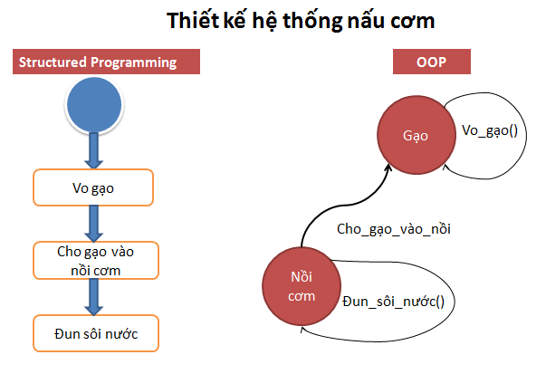

# OOP trong Java

Vậy lập trình hướng đối tượng là gì? Đó chính là một kiểu lập trình với các khái niệm như Lớp (Class), Đối tượng (Object),[**Kế thừa (Inheritance)**](./Inheritance.md), [**tính đóng gói (Encapsulation)**](./Encapsulation.md), [**Trừu tượng (Abstraction)**](./Abstraction.md), [**Đa hình (Polymorphism**](./Polymorphism.md)) gọi tắt là OOP.

Phần lớn các ngôn ngữ lập trình giống như Java, C++, C#, Ruby… đều theo mô hình lập trình hướng đối tượng.

Qua bài viết này, chúng ta sẽ hiểu rõ bản chất các khái niệm cốt lõi của lập trình hướng đối tượng Java qua 4 tính chất của lập trình hướng đối tượng

+ [**Tính đóng gói (Encapsulation)**](./Encapsulation.md)
+ [**Kế thừa (Inheritance)**](./Inheritance.md)
+ [**Trừu tượng (Abstraction)**](./Abstraction.md)
+ [**Đa hình (Polymorphism)**](./Polymorphism.md)

# Vậy lập trình hướng đối tượng là gì

Lập trình hướng đối tượng hay còn gọi là lập trình OOP là kỹ thuật lập trình mà tất cả các logic, yêu cầu thực tế đều được xây dựng xoay quanh các đối tượng.

Khi sử dụng OOP, chúng ta sẽ định nghĩa các class để mô hình hóa các đối tượng thực tế. Trong ứng dụng các class sẽ được khởi tạo thành các instance. Trong suốt thời gian ứng dụng chạy, các phương thức (method) của đối tượng này sẽ được gọi.

Trong thế giới thực, đối tượng là những thực thể tồn tại có trạng thái và hành vi.

# Ưu điểm của OOP

Do lập trình hướng đối tượng ra đời sau này, nên nó kế thừa và khắc phục được những nhược điểm của các mô hình lập trình trước đó.

Với 4 tính chất OOP đặc thù của mình, có thể nói lập trình hướng đối tượng rất thích hợp cho các ứng dụng dành cho doanh nghiệp.

Mình có thể liệt kê một số ưu điểm của OOP:

+ Khả năng mở rộng cao
+ Có khả năng tái sử dụng rất tốt nhờ tính kế thừa
+ Dễ quản lý code khi cần thêm tính năng
+ Dễ học, đơn giản, dễ bảo trì…

# 4 Tính chất của lập trình hướng đối tượng